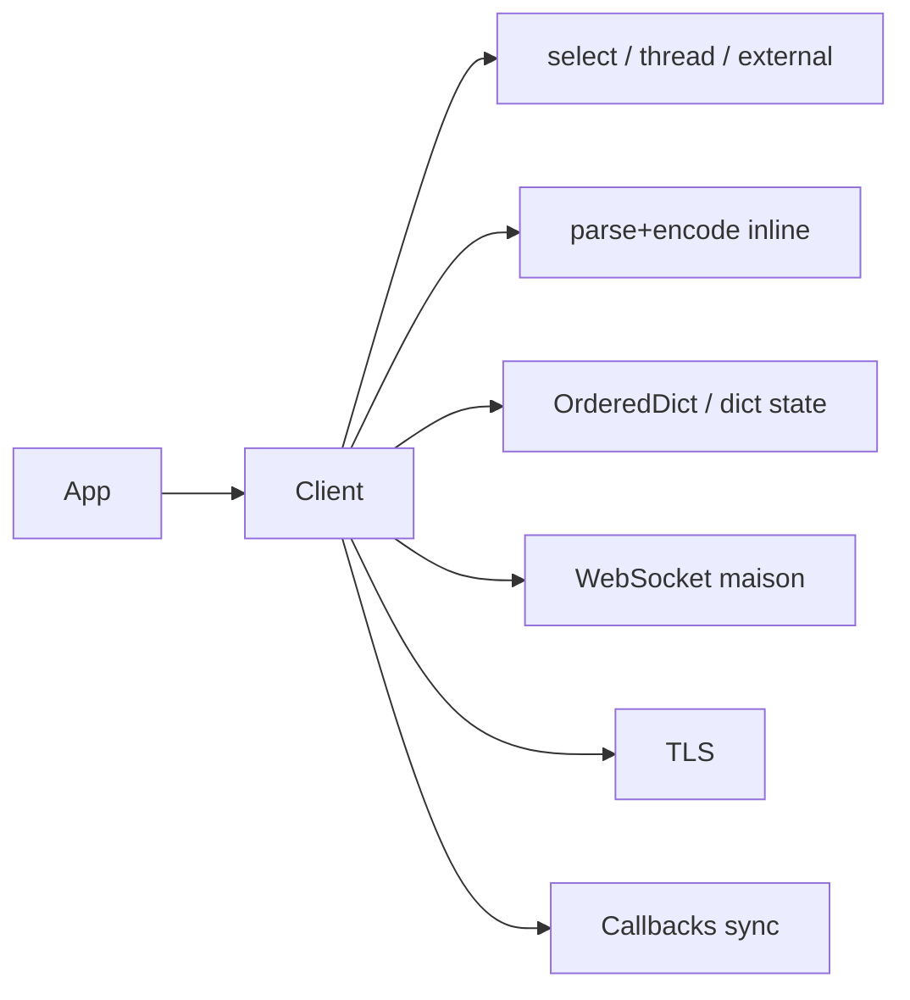
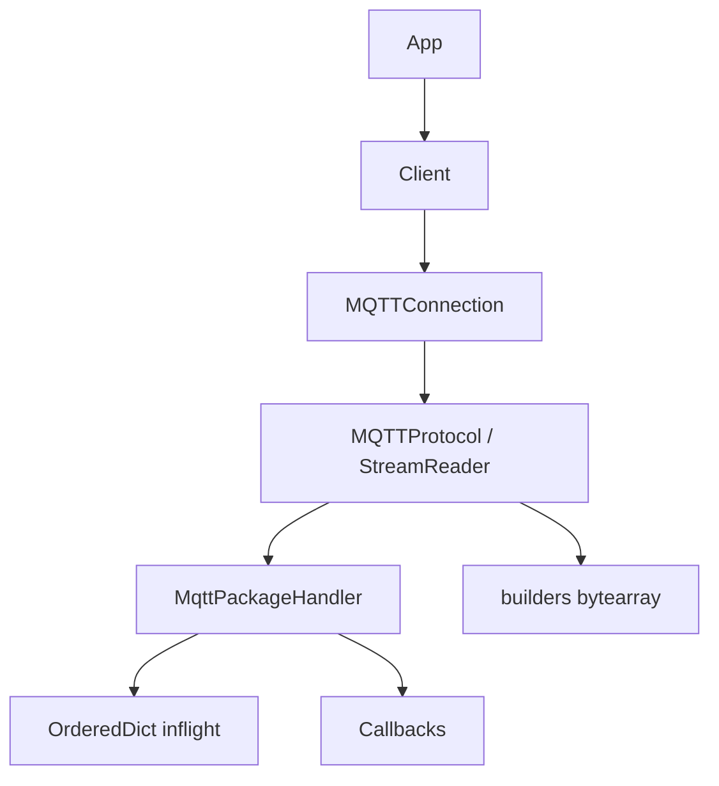

# Analyse comparative — Paho (fork optimisé) vs gmqtt

Ce document synthétise l’audit des deux bases avant la rewrite `mqttnext`.
Il n’est **pas** une copie des README : il capture les décisions de design que la
nouvelle bibliothèque doit respecter ou corriger.

## Périmètre audité

| Source | Emplacement | Focus |
| --- | --- | --- |
| Paho master | `/workspace/src/paho/mqtt` | API publique, monolithe `Client` (~200 KiB), boucles, MQTT 3.1/3.1.1/5 |
| Paho `origin/benchmarks` | `docs/performance-audit/*`, `benchmarks/*` | 28 projets perf GO/NO GO, harness micro + client |
| Paho `origin/perf/interest-check` | même code applicatif que benchmarks | bundle « interest check » pour upstream |
| gmqtt | `/tmp/gmqtt` (clone `yoch/gmqtt`) | client asyncio natif, ~2.2k LOC |

## Verdict en une phrase

**Paho** apporte une API mature, une couverture protocolaire large et des
leçons de performance *mesurées* ; **gmqtt** apporte une architecture async
par couches et un style d’intégration event-loop moderne — mais son moteur
QoS/MQTT 5 n’est pas assez correct pour être porté tel quel.

La bonne cible est donc : **cœur protocolaire from scratch** (correctness
first), **hot paths inspirés des GO de l’audit Paho**, **façade async native
à la gmqtt**, **couche compat Paho additive**.

---

## 1. Architecture

### Paho



- Un seul `Client` concentre API, codec, transports, QoS, threading, WS.
- Quatre modes de boucle mutuellement exclusifs (`loop`, `loop_forever`,
  `loop_start`, intégration externe).
- Optimisations incrémentales sur `benchmarks` améliorent les hot paths mais
  **augmentent encore le monolithe** (~5.8k LOC).

### gmqtt



- Couches utiles (façade / transport / codec / handler).
- Mais responsabilités poreuses : handler ↔ client, storage ↔ client,
  protocole qui encode, état session éclaté.

### Décision mqttnext

Cœur **pur** (sans asyncio ni sockets) + adaptateur transport async + API
async native + adaptateur sync/Paho. Jamais l’inverse.

---

## 2. Performance — leçons mesurées (Paho audit)

Seuls les verdicts **GO** (ou GO with conditions) sont retenus comme
contraintes de design. Les NO GO sont des anti-patterns à ne pas réintroduire.

### À intégrer dès la conception

| Thème | Leçon | Impact observé |
| --- | --- | --- |
| Ingress contigu | Decoder depuis buffer borné ; `memoryview` interne courte durée ; copie à la frontière publique | TCP/TLS petits msgs ~+37% ; burst read-ahead ~+84% |
| Batch naturel | Batcher sur readiness / ACK batch / replay — **pas** de timer pour « remplir » | refill 100 ACK ~+132% |
| Wakeup | Coalescer les réveils ; deadlines monotoniques | 10k wakeups → 1 ; idle CPU −76% |
| Callbacks | Jamais sous verrou d’état QoS | p95 producteur 200ms → 0.03ms |
| State maps | `dict` ordonné natif (Py≥3.7), pas `OrderedDict` | mémoire −53–61% |
| Payload large | Segmenter header/payload immutable ≥ seuil | allocation −99.99% @ 64 MiB |
| MQTT 5 codec | Tables précalculées, curseur, empty-props fast path | unpack riche +53% |
| TLS resume | Session cache **conditionnelle** (TLS1.2 + NODELAY) | handshake −41–69% |
| Cold start | Imports proxy différés | import −28–30% |
| Socketpair | Primitif natif runtime | création −85% |

### À rejeter explicitement

| Idée | Pourquoi NO GO |
| --- | --- |
| Cache implicite d’encodage de topic | −14% à haute cardinalité |
| Alias MQTT 5 automatiques | CPU/concurrence > économie wire |
| `sendmsg()` / writer groupé transport-aware | syscalls ↓ mais débit neutre |
| Ready-queue inflight séparée | complexité, scan déjà O(max_inflight) |
| Duplex scheduler synthétique | régression publish réel |
| Exécuteur générique de callbacks sans contrat | casse ordre / exceptions / shutdown |
| Modifier `loop_read(N)` public pour batcher | gain insuffisant vs contrat API |

### Ordre de grandeur end-to-end (smoke client)

Branche optimisée vs master (indicatif, non ABBA standard) :

- QoS 0 ≈ ×2
- QoS 1 ≈ +80–90%
- QoS 2 ≈ +50–60%

---

## 3. gmqtt — forces à reprendre

1. Intégration asyncio bas niveau (`create_connection` + Protocol).
2. Construction paquets via `bytearray.extend`.
3. État **par client** (MID pool, alias) — jamais global.
4. Stockage inflight injectable + ordre de retransmission.
5. Replay conditionné par `session_present`.
6. Alias remis à zéro à chaque connexion réseau.
7. `time.monotonic()` pour keepalive.
8. Tests offline du moteur (CONNACK, MID, session expiry).

## 4. gmqtt — défauts à corriger (non négociables)

| Sévérité | Défaut |
| --- | --- |
| Critique | QoS 2 sortant : MID libéré + paquet retiré sur PUBREC ; PUBCOMP = no-op |
| Critique | QoS 2 entrant : pas de déduplication (`_messages_in` inutilisé) |
| Critique | `Receive Maximum` appliqué comme borne de l’espace MID |
| Critique | `publish(Message(qos>0))` n’enregistre pas l’inflight (bug `qos` local) |
| Haute | Parser à copies répétées (`buf +=`, slices) ; pas de limite taille |
| Haute | Aucune backpressure d’écriture (`transport.write` direct) |
| Haute | Reconnect sans backoff/jitter ; attentes CONNACK sans timeout |
| Haute | Callbacks async incohérents ; sync `on_message` bloque la lecture |
| Moyenne | Propriétés MQTT 5 non validées par paquet ; AUTH absent |
| Moyenne | Retransmit sans bit DUP ; `server_keep_alive` bug (`_connection` non lié) |

---

## 5. API — ce que mqttnext doit offrir

### Native (priorité)

```python
client = AsyncClient(client_id="…", protocol=MQTTProtocolVersion.MQTTv5)
await client.connect("broker", 1883)
receipt = await client.publish("t", b"payload", qos=1)
await receipt.wait()          # PUBACK / PUBCOMP
async for msg in client.messages():
    ...
await client.disconnect()
```

Callbacks optionnels (style Paho/gmqtt), sync **et** async, hors chemin
critique, avec politique d’erreur explicite.

### Compat Paho (couche additive)

Préserver signatures `CallbackAPIVersion.VERSION2`, `publish()` →
`MQTTMessageInfo`, `loop_*`, helpers `publish`/`subscribe`, transports
tcp/ws/unix — **sans** transformer silencieusement l’API historique en
coroutines.

---

## 6. Limitations Paho à ne pas reproduire

1. Session uniquement en mémoire → perte QoS au redémarrage processus.
2. `clean_session=True` republie QoS>0 (non conforme, risque doublon QoS 2).
3. Callbacks sync bloquent le thread réseau.
4. Pas d’API asyncio native.
5. WebSocket maison couplé au client.
6. `connect_async()` n’est pas async/await.

---

## 7. Principes non négociables pour mqttnext

1. **Correctness before speed** — machines QoS exhaustives, tests de phase.
2. **Engine sync testable** sans socket / event loop.
3. **Zero-copy borné** — `memoryview` interne seulement ; copie à l’API.
4. **Une source de vérité** pour l’état QoS (pas de files dérivées cachées).
5. **Receive Maximum ≠ Packet Identifier space**.
6. **Backpressure** octets + messages dès l’API native.
7. **Persistance injectable** (mémoire → SQLite optionnel).
8. **Python ≥ 3.11** cible (3.12+ pour free-threading readiness) ; pas de
   chemins pré-3.9.
9. **Mesurer** chaque optimisation avec le harness (micro + e2e) avant merge.
10. **Compat Paho additive**, jamais le cœur.
