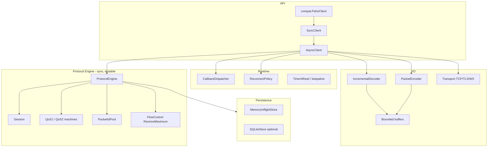

# Design — mqttnext

Nom de travail : **mqttnext** (à renommer lors du spin-out vers un repo dédié).
Objectif : implémentation MQTT Python de référence — async-native, correcte,
performante, avec façade compatible Paho.

## Cibles

| Axe | Cible |
| --- | --- |
| Protocoles | MQTT 3.1.1 et 5.0 (3.1 en compat si demandé) |
| Python | ≥ 3.11 (développement sur 3.12) |
| Runtime | asyncio natif ; sync/thread via adaptateur |
| Transports (v1) | TCP, TLS ; puis WebSocket, Unix |
| Correctness | machines QoS 1/2 complètes ; Receive Maximum ; DUP/dedup |
| Perf | hot paths alignés sur les GO de l’audit Paho |
| API | `AsyncClient` + callbacks optionnels + `compat.paho` |
| Licence | Apache-2.0 (from-scratch ; voir `LICENSE`) |

## Architecture



### Règle d’or

`ProtocolEngine` ne connaît **ni** `asyncio`, **ni** sockets, **ni** callbacks
utilisateurs. Il consomme des `IncomingPacket` et produit des
`EngineEffect` (paquets à émettre, événements applicatifs, transitions).

## Modules

```text
mqttnext/
├── docs/                 # ANALYSIS, DESIGN, ROADMAP, AUDIT
├── src/mqttnext/
│   ├── __init__.py
│   ├── enums.py
│   ├── errors.py
│   ├── types.py
│   ├── codec/            # VBI, buffer, primitives UTF-8/bin
│   ├── packets/          # types + encode/decode par paquet
│   ├── protocol/         # engine, session, qos, ids, flow, keepalive
│   ├── transport/        # TCP/TLS (WS plus tard)
│   ├── persistence/      # memory (+ sqlite plus tard)
│   ├── dispatch/         # matcher, callbacks
│   ├── api/              # AsyncClient, models
│   └── compat/           # notes + façade Paho (progressive)
├── tests/
│   ├── unit/             # engine/codec sans réseau
│   └── integration/      # broker optionnel
├── examples/
└── benchmarks/           # réutiliser idées du harness Paho
```

## Contrats clés

### IncrementalDecoder

- Buffer `bytearray` + offset de lecture ; compaction bornée.
- Lit d’abord fixed header + Remaining Length (max 4 octets).
- Si `maximum_packet_size` négocié / local est dépassé → erreur protocole.
- Paquet contigu → parse par index / `unpack_from` / `memoryview`.
- Paquet à cheval → fallback incrémental (état slots, pas dict).
- **Ne jamais** exposer un `memoryview` du buffer réutilisable à l’API.

### PacketIdPool

- Espace `1..65535`, indépendant de Receive Maximum.
- Un pool **par client** ; les MID entrants ne sont **jamais** `free()` dans
  le pool sortant.
- Séparer clairement : IDs sortants (PUBLISH/SUB/UNSUB) vs tracking entrant QoS2.

### FlowControl

- Fenêtre inflight sortante = `min(local_max, broker_receive_maximum)`.
- Compte uniquement PUBLISH QoS 1/2 non terminés.
- API native : attendre (async) plutôt que lever `OverflowError` par défaut ;
  mode « raise » disponible pour compat.

### QoS 2 outbound

```text
QUEUED → SEND_PUBLISH → WAIT_PUBREC → SEND_PUBREL → WAIT_PUBCOMP → DONE
```

- Sur PUBREC succès : remplacer l’enregistrement persistant par PUBREL (pas
  supprimer le MID).
- Libérer MID uniquement après PUBCOMP (ou erreur terminale).
- Retransmit : positionner DUP sur PUBLISH ; rejouer PUBREL si phase 2.

### QoS 2 inbound

```text
RECV_PUBLISH → DELIVER_ONCE → SEND_PUBREC → WAIT_PUBREL → SEND_PUBCOMP → DONE
```

- Dédupliquer sur MID tant que PUBREL non reçu.
- PUBLISH DUP : ne pas redélivrer à l’application si déjà délivré.

### Session / reconnect

- `session_present=0` → purger inflight local sortant non encore « sessionné »
  selon clean start / session expiry.
- `session_present=1` → rejouer dans l’ordre, en drains bornés
  (ex. 64 paquets / 64 KiB) — leçon audit §17.
- Alias topic : table vidée à chaque **connexion réseau** (pas seulement
  session).
- Politique reconnect : backoff + jitter ; stop sur reason codes définitifs
  (auth, banned, …) ; timeout CONNECT/CONNACK.

### Callbacks

- Snapshot avant dispatch.
- Hors verrou / hors section critique engine.
- Sync et async supportés uniformément.
- Callback lent ne doit pas corrompre l’état ; backpressure / isolation
  documentée (phase 2 : file bornée optionnelle).

## API AsyncClient (v0)

```python
class AsyncClient:
    async def connect(self, host: str, port: int = 1883, *,
                      keepalive: int = 60, ssl: ...) -> ConnAck
    async def disconnect(self, reason_code: int = 0) -> None
    async def publish(self, topic: str, payload: bytes = b"", *,
                      qos: int = 0, retain: bool = False,
                      properties: Properties | None = None) -> PublishReceipt
    async def subscribe(self, topic: str | list, *, qos: int = 0,
                        options: SubscribeOptions | None = None) -> SubAck
    async def unsubscribe(self, topic: str | list) -> UnsubAck
    def messages(self) -> AsyncIterator[Message]
    # callbacks optionnels: on_connect, on_message, on_disconnect, ...
```

`PublishReceipt.wait()` attend l’achèvement protocole (QoS0 = accepté par la
file du writer unique, sans garantie réseau ; QoS1 = PUBACK ; QoS2 = PUBCOMP).
Les sorties passent toutes par **un seul task writer** alimenté par une file
FIFO : l’ordre wire est celui des effets du moteur, quel que soit le nombre de
coroutines qui publient (voir `IMPLEMENTATION-GUIDE.md` §1).

## Compat Paho

Stratégie progressive (voir ROADMAP) :

1. Documenter le mapping API.
2. Adapter sync threadé au-dessus d’`AsyncClient` (un loop dédié).
3. Emuler `CallbackAPIVersion.VERSION2`.
4. Helpers `publish.single/multiple`, `subscribe.simple`.

Ne **pas** viser 100 % de compat byte-for-byte des quirks historiques
(`clean_session` republication non conforme) — documenter les écarts.

## Performance — budget de conception

Appliquer dès le code initial (pas « plus tard ») :

1. Decoder contigu + read-ahead borné.
2. Encoder `bytearray` + fast path Remaining Length < 128.
3. Empty properties fast path MQTT 5.
4. `dict` ordonné pour inflight.
5. Wakeup/coalesce si façade threadée.
6. Payload segmenté au-delà d’un seuil (1 MiB).
7. Callback path sans matching si aucun filtre enregistré.
8. Imports lourds (proxy, WS) différés.

Chaque optimisation ultérieure doit passer un microbench + garde-fou
régression avant merge.

## Tests obligatoires (correctness)

- Fragmentation byte-à-byte et multi-paquets par chunk.
- VBI malformé / overflow taille.
- QoS 2 toutes phases + reconnect entre chaque phase.
- DUP / déduplication inbound.
- Receive Maximum (blocage puis reprise).
- session_present 0/1.
- Propriétés MQTT 5 : contexte paquet, cardinalité, UTF-8 interdit.
- Keepalive / server_keep_alive.
- Annulation `connect()` / `publish().wait()`.
- Concurrence publish pendant callback.

## Hors scope v0

- Bridge mode Paho.
- Plugins AUTH concrets (SCRAM, OAuth) — l’API `auth_handler` est fournie.
- Proxy SOCKS (import différé plus tard).
- Alias automatiques.
- Free-threading production guarantees (mais éviter les globaux mutables).
